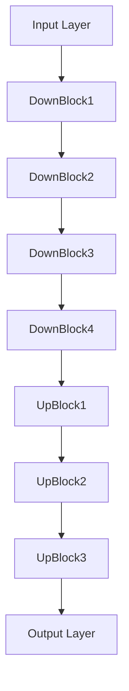

# MRI Anomaly Detection 🧠 

[](https://pytorch.org/)
[](https://www.python.org/)
[![MONAI](https://img.shields.io/badge/MONAI-green.svg?style=for-the-badge&logo=data:image/png;base64,iVBORw0KGgoAAAANSUhEUgAAAA4AAAAOCAYAAAAfSC3RAAAACXBIWXMAAAsTAAALEwEAmpwYAAAFFmlUWHRYTUw6Y29tLmFkb2JlLnhtcAAAAAAAPD94cGFja2V0IGJlZ2luPSLvu78iIGlkPSJXNU0wTXBDZWhpSHpyZVN6TlRjemtjOWQiPz4gPHg6eG1wbWV0YSB4bWxuczp4PSJhZG9iZTpuczptZXRhLyIgeDp4bXB0az0iQWRvYmUgWE1QIENvcmUgNy4yLWMwMDAgNzkuMWI2NWE3OWI0LCAyMDIyLzA2LzEzLTIyOjAxOjAxICAgICAgICAiPiA8cmRmOlJERiB4bWxuczpyZGY9Imh0dHA6Ly93d3cudzMub3JnLzE5OTkvMDIvMjItcmRmLXN5bnRheC1ucyMiPiA8cmRmOkRlc2NyaXB0aW9uIHJkZjphYm91dD0iIiB4bWxuczp4bXA9Imh0dHA6Ly9ucy5hZG9iZS5jb20veGFwLzEuMC8iIHhtbG5zOnhtcE1NPSJodHRwOi8vbnMuYWRvYmUuY29tL3hhcC8xLjAvbW0vIiB4bWxuczpzdEV2dD0iaHR0cDovL25zLmFkb2JlLmNvbS94YXAvMS4wL3NUeXBlL1Jlc291cmNlRXZlbnQjIiB4bWxuczpkYz0iaHR0cDovL3B1cmwub3JnL2RjL2VsZW1lbnRzLzEuMS8iIHhtbG5zOnBob3Rvc2hvcD0iaHR0cDovL25zLmFkb2JlLmNvbS9waG90b3Nob3AvMS4wLyIgeG1wOkNyZWF0b3JUb29sPSJBZG9iZSBQaG90b3Nob3AgMjQuMCAoTWFjaW50b3NoKSIgeG1wOkNyZWF0ZURhdGU9IjIwMjMtMDMtMjdUMTU6NDA6MjAtMDQ6MDAiIHhtcDpNZXRhZGF0YURhdGU9IjIwMjMtMDMtMjdUMTU6NDA6MjAtMDQ6MDAiIHhtcDpNb2RpZnlEYXRlPSIyMDIzLTA2LTIwVDIwOjU0OjMyLTA0OjAwIiB4bXBNTTpJbnN0YW5jZUlEPSJ4bXAuaWlkOjY1ZWY5YjIyLTQ4ZjYtNDU4Ny05YzMyLTkwNzg1ZjU4YzUwMCIgeG1wTU06RG9jdW1lbnRJRD0iYWRvYmU6ZG9jaWQ6cGhvdG9zaG9wOjY1ZWY5YjIyLTQ4ZjYtNDU4Ny05YzMyLTkwNzg1ZjU4YzUwMCIgeG1wTU06T3JpZ2luYWxEb2N1bWVudElEPSJ4bXAuZGlkOjY1ZWY5YjIyLTQ4ZjYtNDU4Ny05YzMyLTkwNzg1ZjU4YzUwMCIgZGM6Zm9ybWF0PSJpbWFnZS9wbmciIHBob3Rvc2hvcDpDb2xvck1vZGU9IjMiPiA8eG1wTU06SGlzdG9yeT4gPHJkZjpTZXE+IDxyZGY6bGkgc3RFdnQ6YWN0aW9uPSJjcmVhdGVkIiBzdEV2dDppbnN0YW5jZUlEPSJ4bXAuaWlkOjY1ZWY5YjIyLTQ4ZjYtNDU4Ny05YzMyLTkwNzg1ZjU4YzUwMCIgc3RFdnQ6d2hlbj0iMjAyMy0wMy0yN1QxNTo0MDoyMC0wNDowMCIgc3RFdnQ6c29mdHdhcmVBZ2VudD0iQWRvYmUgUGhvdG9zaG9wIDI0LjAgKE1hY2ludG9zaCkiLz4gPC9yZGY6U2VxPiA8L3htcE1NOkhpc3Rvcnk+IDwvcmRmOkRlc2NyaXB0aW9uPiA8L3JkZjpSREY+IDwveDp4bXBtZXRhPiA8P3hwYWNrZXQgZW5kPSJyIj8+YjqCzwAAABtpVFh0V0xBTiAyMDIzIEFsbCByaWdodHMgcmVzZXJ2ZWQuAP/tADhQaG90b3Nob3AgMy4wADhCSU0EBAAAAAAATxwBWgADGyVHHAIAAAIAAhwCPwALTU9OQUkgUHJvamVjdBwCQQAMQnJhaW4gSW1hZ2luZxwCQgANTW9uYWkgQW5hbHlzaXMEAwE4Qv/bAEMABgQFBgUEBgYFBgcHBggKEAoKCQkKFA4PDBAXFBgYFxQWFhodJR8aGyMcFhYgLCAjJicpKikZHy0wLSgwJSgpKP/bAEMBBwcHCggKEwoKEygaFhooKCgoKCgoKCgoKCgoKCgoKCgoKCgoKCgoKCgoKCgoKCgoKCgoKCgoKCgoKCgoKCgoKP/CABEIABAADgMBIgACEQEDEQH/xAAVAAEBAAAAAAAAAAAAAAAAAAAFB//EABYBAQEBAAAAAAAAAAAAAAAAAAMBAv/aAAwDAQACEAMQAAABk6pSQXN//8QAGxAAAgEFAAAAAAAAAAAAAAAAAQIDBAURExT/2gAIAQEAAQUCL1RlZFFme48jTP/EABYRAQEBAAAAAAAAAAAAAAAAAAEQMf/aAAgBAwEBPwGmP//EABYRAQEBAAAAAAAAAAAAAAAAAAEQMf/aAAgBAgEBPwGWP//EABoQAAIDAQEAAAAAAAAAAAAAAAABAhARISL/2gAIAQEABj8CnF8LSx0tjZ//xAAaEAEAAwEBAQAAAAAAAAAAAAABABEhMUHR/9oACAEBAAE/IXVixL0vxLqwE7JwTPp5n//aAAwDAQACAAMAAAAQc8//xAAXEQEBAQEAAAAAAAAAAAAAAAABABEx/9oACAEDAQE/EF2zX//EABcRAAMBAAAAAAAAAAAAAAAAAAABETH/2gAIAQIBAT8QpbR//8QAHRAAAwACAgMAAAAAAAAAAAAAAAERITFBUWGRsf/aAAgBAQABPxB6ENY2gpprKFojf0bvin0Jx8H/2Q==)](https://monai.io/)
[](https://opensource.org/licenses/MIT)
[](https://github.com/yourusername/MRIAnomalyDetection)
[](https://github.com/yourusername/MRIAnomalyDetection/graphs/contributors)

> 🔬 Advanced brain tumor segmentation using deep learning on MRI scans

<div align="center">
  
</div>

## ✨ Features

- 🧠 Automated brain tumor segmentation
- 🎯 Multi-class tumor region detection (TC, WT, ET)
- 📊 Real-time training metrics and visualization
- 🔄 Advanced data augmentation pipeline
- 💪 CUDA-accelerated training
- 📈 Performance monitoring and checkpointing

## 🚀 Quick Start

### Prerequisites

| Requirement | Version |
|------------|---------|
| Python | >=3.7 |
| PyTorch | >=1.9 |
| MONAI | >=0.9 |
| CUDA | >=11.0 |

### 🛠️ Installation

```bash
# Clone the repository
git clone https://github.com/yourusername/MRIAnomalyDetection.git
cd MRIAnomalyDetection

# Install dependencies
pip install -r requirements.txt
```

## 📦 Model Architecture



### 🎛️ Configuration

```python
model = SegResNet(
    blocks_down=[1, 2, 2, 4],
    blocks_up=[1, 1, 1],
    init_filters=16,
    in_channels=4,
    out_channels=3,
    dropout_prob=0.2
)
```

## 🏃‍♂️ Training

```bash
python SegResNet-train.py
```

### 📊 Training Parameters

| Parameter | Value |
|-----------|--------|
| Max Epochs | 40 |
| Batch Size | 1 |
| Learning Rate | 1e-4 |
| Weight Decay | 1e-5 |
| Optimizer | Adam |
| Loss Function | Dice Loss |
| LR Scheduler | Cosine Annealing |

## 📈 Performance Monitoring

The training process generates several visualization plots:

- 📉 Epoch Average Loss
- 📊 Validation Mean Dice Score
- 📈 Individual Dice scores for:
  - Tumor Core (TC)
  - Whole Tumor (WT)
  - Enhancing Tumor (ET)

## 📚 Directory Structure

```
MRIAnomalyDetection/
├── 📂 data/
│   └── 📂 BraTS/
├── 📂 models/
│   └── 📄 best_metric_model.pth
├── 📂 plots/
│   ├── 📊 EpochAverageLoss.png
│   ├── 📊 ValMeanDiceTC.png
│   ├── 📊 ValMeanDiceWT.png
│   └── 📊 ValMeanDiceET.png
├── 📄 SegResNet-train.py
├── 📄 requirements.txt
└── 📄 README.md
```

## 🤝 Contributing

Contributions are welcome! Please feel free to submit a Pull Request.

1. Fork the repository
2. Create your feature branch (`git checkout -b feature/AmazingFeature`)
3. Commit your changes (`git commit -m 'Add some AmazingFeature'`)
4. Push to the branch (`git push origin feature/AmazingFeature`)
5. Open a Pull Request

## 📝 License

This project is licensed under the MIT License - see the [LICENSE](LICENSE) file for details.

## 🙏 Acknowledgments

- [MONAI](https://monai.io/) - The Medical Open Network for AI
- [BraTS Dataset](http://braintumorsegmentation.org/) - Brain Tumor Segmentation Challenge
- [PyTorch](https://pytorch.org/) - Open source machine learning framework

## 📫 Contact

Your Name - manasa.mangipudi@rutgers.edu

Project Link: [https://github.com/manasamangipudi/MRIAnomalyDetection](https://github.com/manasamangipudi/MRIAnomalyDetection)

---
<div align="center">
  <sub>Built with ❤️ by Manasa Mangipudi</sub>
</div>
